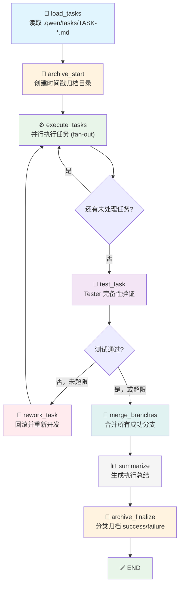

# 用户需求规格 - 核心硬约束

**创建日期**: 2026-04-09
**最后更新**: 2026-04-10 (重构：纯执行模式，Mermaid 工作流图)
**状态**: 已确认，封存
**修改规则**: 除非用户明确同意，否则不得修改

---

## 核心诉求 (Hard Constraints)

以下 6 点是系统的核心设计约束，是**不可妥协的硬要求**。任何架构设计、代码实现、技术选型都必须严格遵循这些约束。

---

### HC-1: LangGraph 状态机驱动

**诉求**: 整个任务调度机制必须由 LangGraph 的状态机驱动。

**原因**:
- 状态机显式定义了执行流程的每一步，AI Agent 只能按照预定义的节点和边执行
- 避免了 AI "自由发挥"导致的流程偏离（如跳过测试、无限循环等）
- 状态转换逻辑由代码控制，不由 AI 决定，确保可预测性

**含义**:
- 不能使用简单的函数调用链或线程池作为主调度机制
- 必须有明确的状态定义（TypedDict）、节点函数、路由函数
- 状态机的图结构决定了"下一步做什么"，AI 只负责"当前步怎么做"

**工作流图**:



---

### HC-2: 单向且隔离的信息流动

**诉求**: 信息流动方向必须是单向的，每个 Developer Agent 只能看到自己的任务上下文。

**关键约束**:
- **Developer Agent 之间互不感知**: 每个 Developer 不知道其他任务的存在
- **无全局上下文传递**: Developer 不接收整个项目的任务列表或状态
- **聚焦原则**: 每个 Developer 只关心自己的任务文件，避免信息过载和跨任务误操作

---

### HC-3: 任务文件是 Markdown 文件

**诉求**: 系统直接从 `.qwen/tasks/` 读取已有的 `TASK-*.md` 任务文件，将整份文件内容作为上下文交给 Developer Agent。

**格式要求**:
- 每个文件对应一个独立任务
- 文件名格式: `TASK-XXX.md`
- 文件内容包含: 任务目标、工作范围（修改/创建/禁止的文件列表）、验收标准、测试要求、约束条件等

**含义**:
- **不需要复杂的 Markdown 解析器**: 系统直接将整个文件内容作为上下文交给 Developer Agent
- 文件是人类可读的，可以被审查、手动修改、版本控制
- 任务之间天然隔离，不存在"字段映射"或"数据丢失"问题

**存储路径**: `<project_dir>/.qwen/tasks/`

---

### HC-4: Tester Agent 必须进行完备性测试

**诉求**: Tester Agent 不是走形式，必须对提交的代码进行完备的测试，尤其关注退化场景（degenerate cases）。

**测试范围**:
1. **代码质量审查**: 逻辑是否正确、代码风格是否规范、是否有明显缺陷
2. **边界条件测试**: 空输入、非法输入、极端值、并发场景
3. **验收标准验证**: 逐项检查任务 Markdown 文件中的验收标准 checklist
4. **退化场景覆盖**: 确保代码在异常情况下的行为正确（如网络超时、资源不足等）

**输出要求**:
- 必须给出明确的通过/不通过结论
- 不通过时必须说明具体失败原因和修复建议
- 输出格式应为结构化数据（如 JSON），便于系统解析和路由决策

**角色定位**: Tester 是质量守门员，不是橡皮图章。不达标就打回，没有例外。

---

### HC-5: 时间戳归档

**诉求**: 在每次执行开始时，系统必须创建时间戳命名的归档目录，并将所有待执行的任务文件移入其中。执行完成后，按成功/失败分类归档。

**目录结构**:

执行开始时:
```
<project_dir>/.qwen/tasks/<timestamp>/
├── unfinished/          ← 本次执行所有待执行的任务文件（从 tasks/ 根目录移入）
│   ├── TASK-001.md
│   ├── TASK-002.md
│   └── ...
├── success/             ← 空，待填充
└── failure/             ← 空，待填充
```

执行完成后:
```
<project_dir>/.qwen/tasks/<timestamp>/
├── unfinished/          ← 未执行/中断残留的任务文件（如有）
├── success/             ← 成功完成的任务
│   ├── TASK-001.md
│   └── TASK-002.md
└── failure/             ← 失败的任务（超过最大重试次数）
    └── TASK-003.md
```

**含义**:
- `<timestamp>` 格式: `YYYYMMDD-HHMMSS`，确保每次执行有独立的归档目录
- **执行开始时**: 立即将 `tasks/` 根目录下所有 `*.md` 文件移动到 `unfinished/`，确保 `tasks/` 根目录在执行期间是干净的
- **执行过程中**: 任务完成一个，就从 `unfinished/` 移动到 `success/` 或 `failure/`
- **执行结束时**: `unfinished/` 中剩余的为未执行或中断的任务
- 归档目的是清晰地记录每次执行的结果，便于追溯

---

### HC-6: 模式化架构，预留扩展能力

**诉求**: 系统必须支持模式化设计，当前实现"普通开发模式"(dev)，但框架必须为未来的其他模式（如 TDD 模式等）预留扩展能力。

**CLI 接口约定**:
```bash
orchestrator run              # 执行 .qwen/tasks/ 中的所有任务
orchestrator run -p 5         # 指定并行度
orchestrator status           # 查看历史
orchestrator info             # 查看配置
```

**含义**:
- 每种模式可能有不同的 Agent 组织方式、不同的状态机流程、不同的工作流定义
- 当前只需实现纯执行模式，但代码结构必须支持未来添加新模式
- 推荐使用策略模式或工厂模式，使新模式可以独立定义其 LangGraph 工作流，而无需修改已有代码
- 不同模式的工作流可以共享部分组件（如 GitManager），但状态机定义和节点逻辑完全独立

---

## 约束优先级

| 约束编号 | 描述 | 优先级 | 可协商? |
|----------|------|--------|---------|
| HC-1 | LangGraph 状态机驱动 | P0 | ❌ 不可协商 |
| HC-2 | 单向隔离的信息流动 | P0 | ❌ 不可协商 |
| HC-3 | Markdown 文件驱动 (整文件传递) | P0 | ❌ 不可协商 |
| HC-4 | Tester 完备性测试 | P0 | ❌ 不可协商 |
| HC-5 | 时间戳归档 | P0 | ❌ 不可协商 |
| HC-6 | 模式化架构预留扩展能力 | P0 | ❌ 不可协商 |

---

## 违反约束的场景 (明确禁止)

以下设计决策**明确违反**用户核心诉求，禁止采用:

| 禁止方案 | 违反约束 | 原因 |
|----------|----------|------|
| 使用 ThreadPoolExecutor 作为主调度 | HC-1 | 不是状态机驱动 |
| 在 Developer 间共享全局上下文 | HC-2 | 破坏信息隔离 |
| 使用 JSON 作为任务文件 | HC-3 | 不是人类可读的 Markdown |
| 编写复杂的 Markdown 解析器提取字段 | HC-3 | 违背"整文件传递"原则 |
| Tester 只运行 shell 命令不审查代码 | HC-4 | 不是完备性测试 |
| 测试失败直接标记失败不返工 | HC-2 | 缺少返工循环 |
| 执行开始时不清理 tasks/ 根目录的旧任务文件 | HC-5 | 旧任务会被重新分发 |
| 无法解析 Tester JSON 输出时默认通过 | HC-4 | 质量守门员放水 |
| 将所有模式的逻辑耦合在同一个工作流类中 | HC-6 | 违背模式化扩展原则 |

---

## 设计决策检查清单

任何新的设计决策或代码变更，都必须通过以下检查:

- [ ] 是否使用 LangGraph 状态机驱动调度？(HC-1)
- [ ] Developer 是否只能看到自己的任务文件？(HC-2)
- [ ] 任务是否以 Markdown 文件形式存储在 `.qwen/tasks/`？(HC-3)
- [ ] 系统是否将整文件内容交给 Developer（而非解析后提取部分字段）？(HC-3)
- [ ] Tester 是否进行代码审查和边界条件测试？(HC-4)
- [ ] 测试失败是否有返工循环？(HC-2)
- [ ] 执行开始时是否创建时间戳目录并归档？(HC-5)
- [ ] 新模式是否可以独立添加，而不修改已有模式的代码？(HC-6)

---

**封存确认**: 本文档记录用户核心诉求，后续所有架构设计和代码实现都必须严格遵循这些约束。

**最后更新**: 2026-04-10
**维护者**: 用户本人
